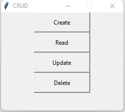

# CRUD_v1.0

# Crud com DTM
 

## Função:

* Programa desenvolvido em Python com uso do banco de dados(DTM).Afim de um teste de um CRUD, ou seja, operações básicas do sistema

 

## Ferramentas e tecnologias utilizadas

1- Python  
2- SQLite  
3- Visual Studio Code

 

 
 

## Uso do video
 
<video src="funcional.webm" controls="controls">Uso do programa</video>
[funcional.webm](https://user-images.githubusercontent.com/102334175/204621849-88d65660-d2db-4f6f-b301-6c1f69b71b2c.webm)
